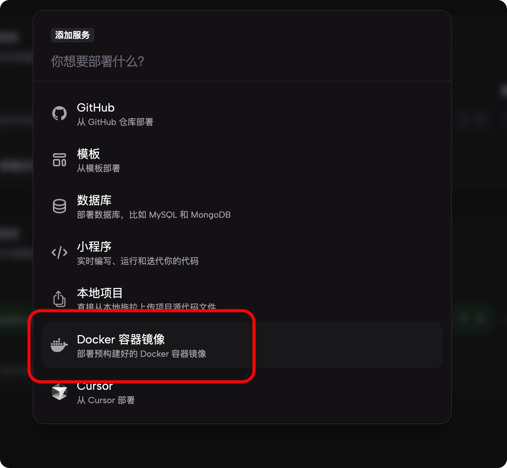
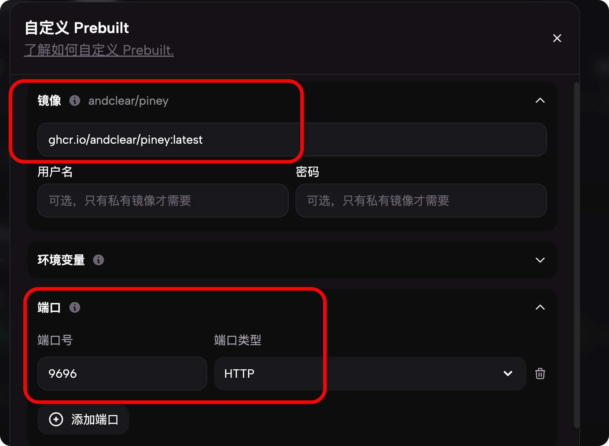
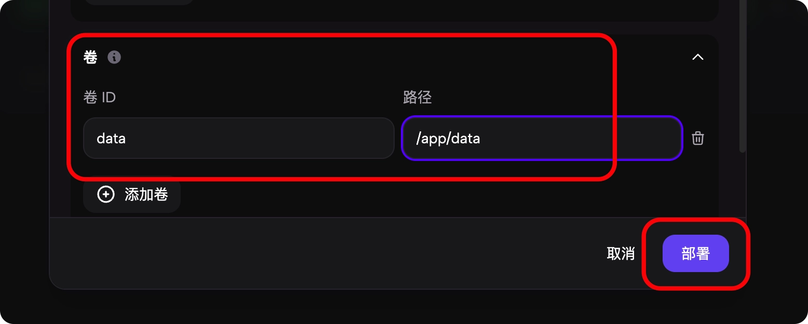

# 🐿 Piney (小兄许)

<div align="center">
  
</div>

*其实懒得写，凑合看一下*

> **SillyTavern角色卡工作站**

Piney 是一个现代化的角色卡管理系统，专为 SillyTavern 用户和创作者设计。它不仅仅是一个管理器，更是一个集创作、编辑、统计、展示于一体的“卡片管家”。

## ✨ 核心特性

- **📚 角色卡深层管理**：支持 V2/V3 规范，深度解析 Character Card 数据（包括 World Info、Regex Scripts），同时支持新建角色卡，AI 辅助生成内容等。
- **🕵️‍♀️ 聊天记录查看**：导入 SillyTavern 聊天记录，查看 Token 消耗、聊天轮数，甚至可以回放聊天过程。
- **🌍 世界书与小剧场**：独立的 World Info 编辑器，以及“小剧场”存储功能（Theaters）。
- **🎨 智能图库**：管理角色相关的插图、立绘。支持自动读取 ComfyUI/NovelAI 元数据，AI 标记与授权管理。
- **🖌 前端美化**：一键生成世界书条目、正则、样式，可以一键插入到角色卡。
- **💾 数据备份**：一键导出/导入备份。
- **🌏 其他功能**：一些小功能，例如每次角色卡推荐、抽卡、世界书条目导入到全局世界书、从全局世界书中导入条目、小皮医生检测角色卡”质量“等，等你发现。

## 🛠️ 技术栈

本项目采用前后端分离的现代化架构：

- **后端**: [Rust](https://www.rust-lang.org/) + [Axum](https://github.com/tokio-rs/axum)
  - 数据库: SQLite + [SeaORM](https://www.sea-ql.org/SeaORM/) (Async)
  - 迁移管理: SeaORM Migration
- **前端**: [SvelteKit](https://kit.svelte.dev/) (Svelte 5)
  - UI 库: [Shadcn-Svelte](https://next.shadcn-svelte.com/) + TailwindCSS
  - 图标: Lucide Icons
- **部署**: Docker / Docker Compose

## 🚀 快速开始

### 前置要求
- Rust (最新稳定版)
- Node.js (v18+)
- pnpm (推荐) 或 npm

### 本地开发

1. **克隆项目**
   ```bash
   git clone https://github.com/andclear/piney.git
   cd piney
   ```

2. **后端设置**
   ```bash
   # 安装依赖并运行（会自动创建数据库并执行迁移）
   cargo run
   ```
   后端默认运行在 `http://127.0.0.1:9696`。

3. **前端设置**
   ```bash
   cd frontend
   npm install
   npm run dev
   ```
   前端默认运行在 `http://127.0.0.1:5173`。

4. **访问**
   打开浏览器访问前端地址，首次使用会要求注册。后期忘了密码可以查看：`data/config.yml`（首次运行后生成）。

## 🐳 Docker Compose 部署

创建文件夹

```
mkdir piney && cd piney
```

创建 docker-compose文件

```
nano docker-compose.yml
```

复制并粘贴下方代码

```
services:
  piney:
    image: ghcr.io/andclear/piney:latest
    container_name: piney
    restart: unless-stopped
    ports:
      - "9696:9696"
    volumes:
      - ./data:/app/data
    environment:
      - RUN_MODE=server
      - PORT=9696
    healthcheck:
      test: [ "CMD", "curl", "-f", "http://localhost:9696/api/health" ]
      interval: 30s
      timeout: 10s
      retries: 3
      start_period: 10s

```

按 `Ctrl+O`（字母欧）保存，按`Ctrl+X`退出

然后执行：

```
docker compose up -d
```

## Zeabur部署方法：

1. 新建服务


2. 选择 Docker容器镜像



3. 填写镜像信息、端口



4. 添加数据卷



完成，之后可以自己创建访问链接。

镜像填写：

```
ghcr.io/andclear/piney:latest
```

端口：9696

数据卷：
- 左边：data
- 右边：/app/data


## 📂 数据库迁移

项目使用 SeaORM 管理数据库结构。

- **开发环境自动迁移**：每次启动 `cargo run` 时，程序会自动检测并未应用的迁移脚本并执行。
- **结构合并**：主要迁移脚本已合并为 `migration/src/m000001_v1_init.rs`，支持从旧（内测）版本自动平滑升级。

## 🤝 贡献

欢迎提交 Issue 或 Pull Request！

## 📄 许可证

CC BY-NC-SA 4.0